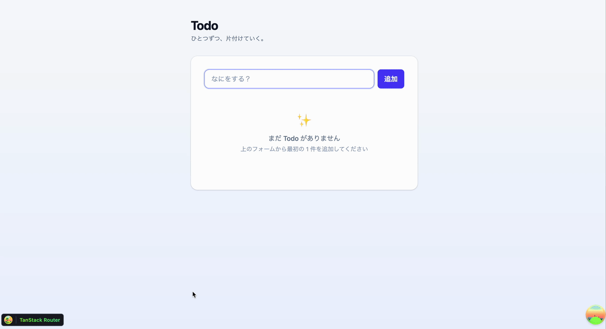
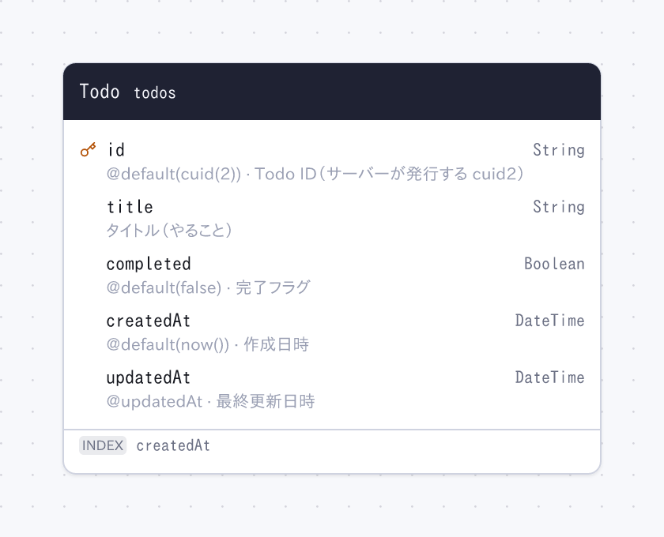

# zod-openapi-hono-todo

TypeSpec と Prisma を正典に、API とデータベース定義を生成する Todo アプリ。
Cloudflare Workers + D1 + React SPA。



## Getting started

```sh
pnpm install
pnpm cf-typegen     # cloudflare-env.d.ts を生成
pnpm generate       # src/db/schema.ts からマイグレーションを生成
pnpm local:migrate  # ローカル D1 に適用
pnpm dev            # http://localhost:8787
```

リモート D1 への push / migrate をするときだけ `.env.example` を `.env` にコピーして
Cloudflare の値を入れる。ローカル開発では不要。


